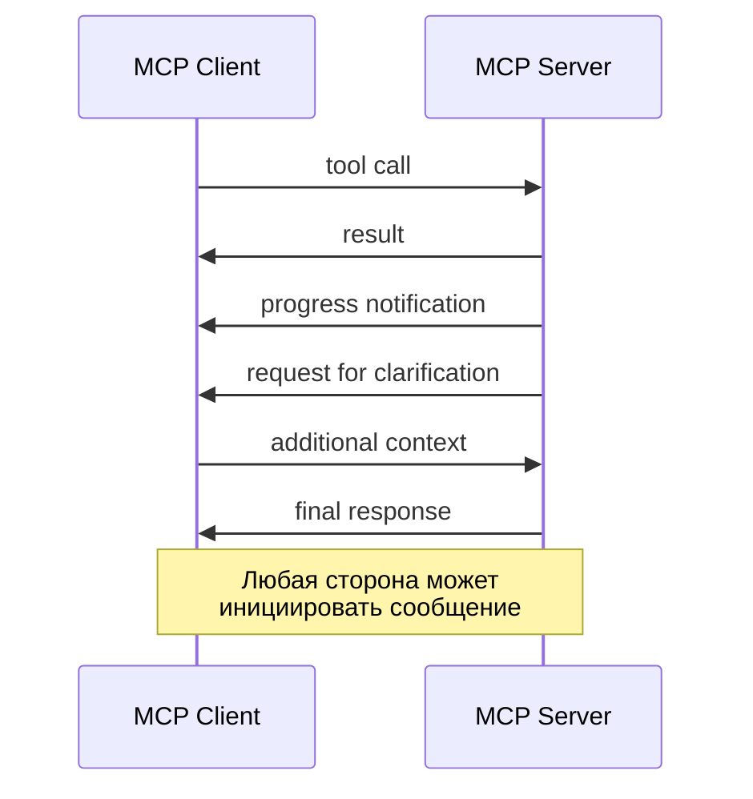

```mermaid
sequenceDiagram
    participant C as MCP Client
    participant S as MCP Server
    
    C->>S: tool call
    S->>C: result
    S->>C: progress notification
    S->>C: request for clarification
    C->>S: additional context
    S->>C: final response
    
    Note over C,S: Любая сторона может<br/>инициировать сообщение
```