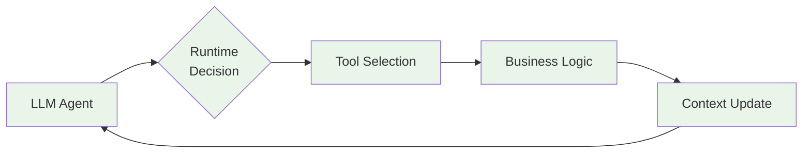

```mermaid
graph LR
    A[LLM Agent] --> B{Runtime<br/>Decision}
    B --> C[Tool Selection]
    C --> D[Business Logic]
    D --> E[Context Update]
    E --> A
    
    classDef adaptive fill:#e8f5e8
    class A,B,C,D,E adaptive
```