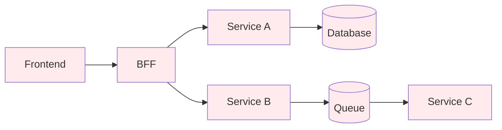

```mermaid
graph LR
    A[Frontend] --> B[BFF]
    B --> C[Service A]
    B --> D[Service B]  
    C --> E[(Database)]
    D --> F[(Queue)]
    F --> G[Service C]
    
    classDef fixed fill:#ffebee
    class A,B,C,D,E,F,G fixed
```