<!-- _paginate: skip -->

# От REST к MCP: 
# как LLM меняют принципы проектирования API и архитектуры систем 
## Дмитрий Бондарев

---

# Agenda

1. Введение
2. Современное состояние API (REST, GraphQL, gRPC)
3. Появление LLM-агентов и новые вызовы
4. Проблемы классических API в контексте LLM
5. Знакомство с MCP как решением
6. Изменения в архитектурных принципах
7. Новая архитектура системы
8. Безопасность и новые риски
9. Практические примеры

---

# 1. Введение

---

<!-- header: 1. Введение -->

## Что такое API?

**API (application programming interface)** — это формально описанный способ, по которому одна программа обращается к другой: какие операции доступны, какие параметры и форматы данных нужны, какие ошибки возможны и что гарантирует система.

Иными словами, это **контракт** между «поставщиком» функций/данных и их «потребителем», независимый от внутренней реализации.

---

## Краткая историческая справка об API

- **≈80 лет назад (≈1945–1951):** 
    - Появились первые библиотеки подпрограмм и модульный подход.

- **≈57 лет назад (1968):** 
    - В инженерных текстах закрепился термин **API** (*application program interface*)

- **≈25 лет назад (≈2000):** 
    - Началась эпоха **веб-API**: компании стали открывать HTTP-интерфейсы для внешних разработчиков.

---


<!-- header: 2. Современное состояние API (REST, GraphQL, gRPC) -->

# 2. Современное состояние API (REST, GraphQL, gRPC)

---

## Сравнительная таблица: REST vs GraphQL vs gRPC

<div style="font-size: 20px;">

| Аспект | REST | GraphQL | gRPC |
|--------|------|---------|------|
| **Основной принцип** | Stateless, ресурсо-ориентированный | Гибкие запросы, одна точка входа | Типизированные контракты |
| **Главные проблемы** | Overfetching<br/> Underfetching | N+1 problem<br/> сложность кеширования | Жесткие контракты, сложность отладки |
| **Формат данных** | JSON/XML | JSON | ProtoBuf (бинарный) |
| **Типизация** | Слабая | Строгая схема | Строгая типизация |
| **Discovery механизм** | Статическая документация (OpenAPI) | Introspection запросы | Static protobuf схемы |
| **Состояние сессии** | Stateless по определению | Stateless (как правило) | Поддерживает streaming |
| **Гранулярность операций** | Мелкие ресурсо-ориентированные | Гибкая, но часто мелкозернистая | Может быть любой |
| **Адаптивность во время выполнения** | Жесткие контракты | Частично гибкие запросы | Жесткие контракты |
</div>

---

## Общая проблема: клиент должен заранее знать API

Во всех трех подходах клиент (программа) должен **заранее знать структуру API**:
- Какие эндпоинты доступны?
- Какие параметры принимают?
- Какой формат ответа ожидать?
- Какие ошибки возможны?

**Это создает жесткую связанность** между клиентом и сервером.

---

## Принцип HATEOAS: почему он не решает проблему полностью

**HATEOAS** (Hypermedia as the Engine of Application State) — принцип REST, где сервер включает в ответы ссылки на доступные действия.

<div style="font-size: 17px;">

```json
{
  "user": {
    "id": 123,
    "name": "Иван",
    "_links": {
      "self": "/users/123",
      "edit": "/users/123/edit",
      "delete": "/users/123"
    }
  }
}
```
</div>

<div style="font-size: 18px;">

### Почему не решает проблему:
- Клиент все равно должен понимать семантику ссылок
- Требует стандартизации форматов (HAL, JSON-LD)
- Сложность реализации на практике
- Не решает проблему динамического обнаружения возможностей
</div>

---


<!-- header: 3. Появление LLM-агентов -->

# 3. Появление LLM-агентов

---

- **30 ноября 2022**: релиз ChatGPT (на базе GPT 3.5)
- **Август 2025**: MAU ChatGPT ≈ 812 миллионов пользователей

- **2025 год** - назван годом Агентов 

> *"Если 2024 был годом LLM, то 2025 выглядит как год AI‑агентов"*  
> — The Guardian

---

## Что такое Agent и отличие его от Workflow

**Главная отличительная черта Агентов**: неопределенность вычислительного DAG. 
Решение об используемых сервисах происходит в процессе выполнения.

Иначе это **workflow** и проблема так остро не стоит. Прибить гвоздями и жестко определить вызовы 

<!-- // TODO  -->
<!-- - уточнить с каких сторон может быть LLM. и 
(но опять же может не быть знания какие методы использовать)
- найти картинки для иллюстрации -->

---

## Какие же проблемы возникают при переходе на искользование LLM как consumer?

---


<!-- header: 4. Проблемы классических API в контексте LLM -->

# 4. Проблемы классических API в контексте LLM

---

## Проблема MxN


<!-- _footer: https://huggingface.co/learn/mcp-course/unit1/key-concepts -->

---

## Проблема self-discovery: агент не знает доступные API

Классические API: программный клиент заранее знает доступные эндпоинты
- его запрограммировали разработчики

LLM-агенты: должны динамически обнаруживать возможности
- Нужен программный способ узнать доступные операции
- Описания должны быть понятными для LLM

---


## Проблема контекста 

<div style="font-size: 28px;">

Stateless накладывает дополнительную нагрузку на LLM агента и увеличивает вероятность ошибок и время выполнения операции

REST подход: каждый запрос содержит всю информацию
```
GET /api/tasks?user_id=123&status=active&page=1
GET /api/tasks?user_id=123&status=active&page=2
```
Разработчики могу реализовывать сессии, но это не включено в саму спецификацию.

Агентные сессии: длительные диалоги с контекстом
- "Покажи мои задачи" → "Отметь первую как выполненную" → "Создай похожую"
- Нужно помнить предыдущие действия и состояние
- Избыточность передачи контекста в каждом запросе
</div>

---

## Проблема гранулярности: мелкие операции vs человеческие задачи

Классические API: множество мелких операций
```
1. GET /user/123
2. GET /user/123/orders
3. POST /reports
4. PUT /reports/456
```

Человекочитаемые задачи: крупнозернистые операции
- "Подготовь отчет по клиенту"
- "Обнови статус заказа и уведоми клиента"
- Один инструмент = одна человеческая задача

---

## Проблема выбора инструментов среди большого числа опций
- Cognitive Load -  слишком много вариантов
- Качество выбора падает с ростом количества опций


<!-- _footer: https://arxiv.org/abs/2310.03128 -->

---


<!-- header: 5. Знакомство с MCP -->

# 5. Знакомство с Model Context Protocol (MCP)

---

## Что такое MCP?

MCP (Model Context Protocol) — это открытый стандарт для подключения AI-ассистентов к источникам данных и инструментам.

- Универсальный адаптер: подобно USB-C для AI-приложений
- Стандартизированный способ подключения AI-моделей к различным сервисам
- Основан на JSON-RPC 2.0 протоколе

---

## Архитектура: Client-Host-Server


<!-- _footer: https://modelcontextprotocol.io/specification/2025-06-18/architecture -->


---

## Ключевые принципы дизайна MCP

### 1. Серверы должны быть крайне простыми в разработке
- Хост-приложения берут на себя сложную оркестрацию
- Серверы фокусируются на конкретных, четко определенных возможностях
- Минимальные накладные расходы на реализацию

### 2. Серверы должны быть высоко композиционными
- Каждый сервер предоставляет изолированную функциональность
- Множественные серверы легко комбинируются
- Модульный дизайн поддерживает расширяемость

---

## Ключевые принципы дизайна MCP (продолжение)

<div style="font-size: 28px;">

### 3. Серверы не должны видеть полный контекст диалога
- Серверы получают только необходимую контекстную информацию
- Полная история разговора остается у хоста
- Каждое серверное соединение изолировано
- Взаимодействия между серверами контролируются хостом

### 4. Возможности могут добавляться прогрессивно
- Базовый протокол предоставляет минимально необходимую функциональность
- Дополнительные возможности согласовываются по мере необходимости
- Серверы и клиенты развиваются независимо
- Поддерживается обратная совместимость
</div>

---

## Capability Negotiation — согласование возможностей

- Клиенты и серверы **явно заявляют** о поддерживаемых функциях при инициализации
- Определяет, какие функции протокола доступны в течение сессии

**Серверы могут заявлять:**
- `resources` — поддержка ресурсов с подписками
- `tools` — возможность вызова инструментов
- `prompts` — предоставление шаблонов промптов

**Клиенты могут заявлять:**
- `sampling` — поддержка запросов на выборку от сервера
- `notifications` — обработка уведомлений

---

## Способы подключения MCP

### Локальное выполнение (STDIO)
- Прямое взаимодействие через стандартные потоки ввода/вывода
- Преимущества
  - Высокая производительность: нет сетевых задержек
  - Безопасность: выполнение в локальной среде

### Удаленное выполнение (HTTP + SSE)
- HTTP запросы для вызова инструментов
- Преимущества
  - Server-Sent Events (SSE) для двунаправленной связи
  - Масштабируемость. распределенная архитектура

---


<!-- header: 6. Преимущества MCP -->

# 6. Как MCP решает проблемы классических API

---

## Решение проблемы MxN: M + N вместо M × N


<!-- _footer: https://huggingface.co/learn/mcp-course/unit1/key-concepts -->

---

## Решение проблемы self-discovery: динамическое обнаружение инструментов
<div style="font-size: 22px;">

**Проблема:** LLM-агенты должны динамически обнаруживать возможности, но классические API не предоставляют программный способ узнать доступные операции.

**Решение MCP:** Runtime discovery через стандартизированные методы
</div>

<div style="font-size: 18px;">

```json
{ // Запрос списка доступных инструментов
  "jsonrpc": "2.0",
  "method": "tools/list",
  "id": 1
}

{ // Ответ с описанием инструментов
  "jsonrpc": "2.0",
  "result": {
    "tools": [
      {
        "name": "create_report",
        "description": "Создает отчет по клиенту",
        "inputSchema": { ... }
      }
    ]
  },
  "id": 1
}
```
</div>

---

## Решение проблемы контекста: от stateless к stateful-сессиям

Классические API (stateless): Stateless подход REST API накладывает дополнительную нагрузку на LLM агента, увеличивает вероятность ошибок и время выполнения.
```http
GET /api/tasks?user_id=123&status=active&filter=urgent
GET /api/tasks?user_id=123&status=active&filter=urgent&page=2
POST /api/tasks { "user_id": 123, "title": "New task", ... }
```

MCP (stateful): Встроенная поддержка контекстных сессий
```json
// Контекст сохраняется между вызовами
1. "Покажи мои срочные задачи"
2. "Отметь первую как выполненную" // знает о предыдущем списке
```

---

## Решение проблемы гранулярности: "one tool, one human task"

<div style="font-size: 28px;">

Классические API: множество мелких вызовов
```
1. GET /user/123
2. GET /user/123/orders  
3. GET /orders/456/items
4. POST /reports { user_data, order_data, items_data }
5. PUT /reports/789 { status: "completed" }
```

MCP: высокоуровневые инструменты, соответствующие человеческим задачам
```json
{
  "name": "generate_customer_report",
  "description": "Создает полный отчет по клиенту с историей заказов",
  "parameters": {
    "customer_id": 123,
    "period": "last_month"
  }
}
```
</div>

---

## Решение проблемы выбора инструментов: структурированная организация
<div style="font-size: 27px;">

**Проблема:** Cognitive Load - слишком много вариантов, качество выбора падает с ростом количества опций.

**Решение MCP:** 
- Иерархическая организация инструментов по серверам
- Семантические описания для LLM
- Возможность группировки по контексту использования

```json
// Инструменты организованы по серверам
{
  "filesystem_server": ["read_file", "write_file", "list_directory"],
  "database_server": ["query_db", "update_records"],
  "email_server": ["send_email", "create_draft"]
}
```
</div>


## Дополнительные преимущества: гибкость развертывания

### Локальное выполнение (STDIO)
```bash
# Запуск MCP-сервера как локального процесса
./mcp-server --stdio
```
Преимущества:
- Высокая производительность (нет сетевых задержек)
- Максимальная безопасность
- Простота отладки

---

### Удаленное выполнение (HTTP + SSE)
```http
POST /mcp/tools/call
Content-Type: application/json

{ "tool": "create_report", "params": {...} }
```
Преимущества:
- Масштабируемость
- Централизованное управление
- Возможность распределенной архитектуры

---


## Дополнительные преимущества: Двунаправленная связь. server-initiated messages

Серверы могут инициировать сообщения и уведомления
<div style="font-size: 18px;">

```json
// Сервер может отправить progress notification
{
  "jsonrpc": "2.0",
  "method": "notifications/progress",
  "params": {
    "progressToken": "report_generation_123",
    "progress": 75,
    "total": 100
  }
}

// Сервер может запросить дополнительную информацию
{
  "jsonrpc": "2.0", 
  "method": "sampling/createMessage",
  "params": {
    "messages": [
      {
        "role": "assistant",
        "content": "Для создания отчета нужна дополнительная информация. Какой период включить?"
      }
    ]
  }
}
```
</div>

---

<!-- header: 7. Фундаментальные изменения в архитектуре -->

# 7. Фундаментальные изменения в архитектуре

---

## От детерминированности к адаптивности

### Классическая архитектура: детерминированные графы вызовов

<div style="font-size: 24px;">

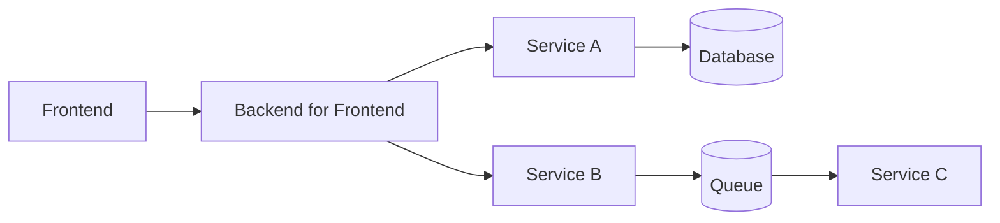

- **Статический DAG**: последовательность вызовов известна на этапе компиляции
- **Предсказуемые пути выполнения**: if/else логика в коде
- **Ошибки = баги**: неправильный вызов означает ошибку разработчика

### MCP архитектура: адаптивные графы выполнения

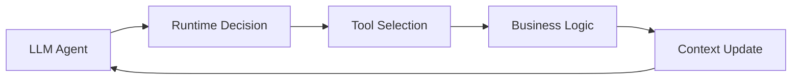

- **Динамический DAG**: граф строится в runtime на основе контекста
- **Адаптивные пути**: LLM выбирает стратегию выполнения
- **Неопределенность как норма**: система адаптируется к новым сценариям
</div>

---

## Новая роль разработчика: от императивного к декларативному

<div style="font-size: 26px;">

**Классический подход**: Разработчик программирует точный алгоритм
```javascript
if (user.role === 'admin') {
  result = await getAdminData();
} else if (user.role === 'manager') {
  result = await getManagerData();
}
```

**MCP подход**: Разработчик определяет возможности и ограничения
```json
{
  "tools": ["get_admin_data", "get_manager_data"],
  "policies": {
    "get_admin_data": {"requires": ["admin_role"]},
    "get_manager_data": {"requires": ["manager_role"]}
  }
}
```

**Ключевое изменение**: От программирования поведения к программированию возможностей
</div>

---

## От stateless к stateful

### Architectural Implications

<div style="font-size: 24px;">

**REST/HTTP архитектура**: Каждый запрос независим
- Простое горизонтальное масштабирование
- Любой сервер может обработать любой запрос
- Отказоустойчивость через stateless репликацию

**MCP архитектура**: Долгоживущие сессии с контекстом
- Необходимость Sticky Sessions или Shared State
- Session Affinity в load balancer
- Сложности при failover и rolling updates

### Возврат к stateful-аспектам: когда это оправдано и какова цена

MCP не «заставляет» делать систему stateful, но добавляет управляемое состояние там, где оно даёт ценность:
- Разговорный контекст и история — у `Host`.
- Инструментальные артефакты и прогресс — у сервера или во внешнем сторе при необходимости.
- Транспортные аспекты (SSE/streaming) — требуют привязки соединений на время операции.

**Где появляется цена:**
- Управление длительными соединениями и session affinity.
- Хранение артефактов между вызовами инструмента (не истории диалога).
- Координация failover и rolling updates при наличии внешнего стора.

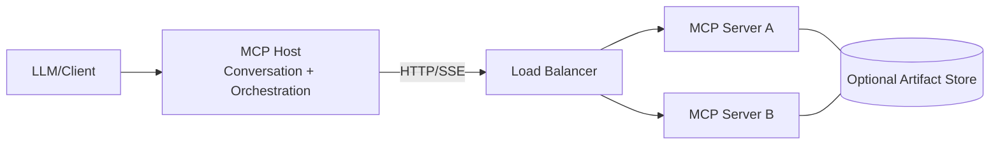

**Паттерны состояния:**
1) Stateless инструменты — все параметры в каждом вызове; без shared store.  
2) Эфемерное состояние на соединении — нужна stickiness на время операции/streaming.  
3) Внешний Artifact Store — файлы, отчёты, промежуточные результаты; шарится между инстансами одного сервиса.

</div>

---

## От однонаправленной к двунаправленной связи

### Классические API: Request-Response модель

<div style="font-size: 24px;">

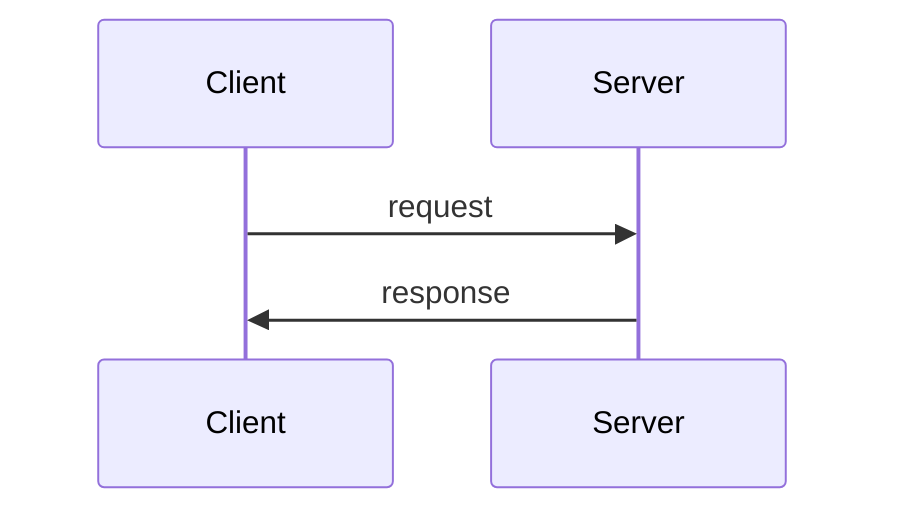

**Ограничения**:
- Сервер не может инициировать взаимодействие
- Для server-push нужны дополнительные механизмы (WebSockets, SSE)
- Нет стандартизированного способа для обратной связи

### MCP: Встроенная двунаправленность

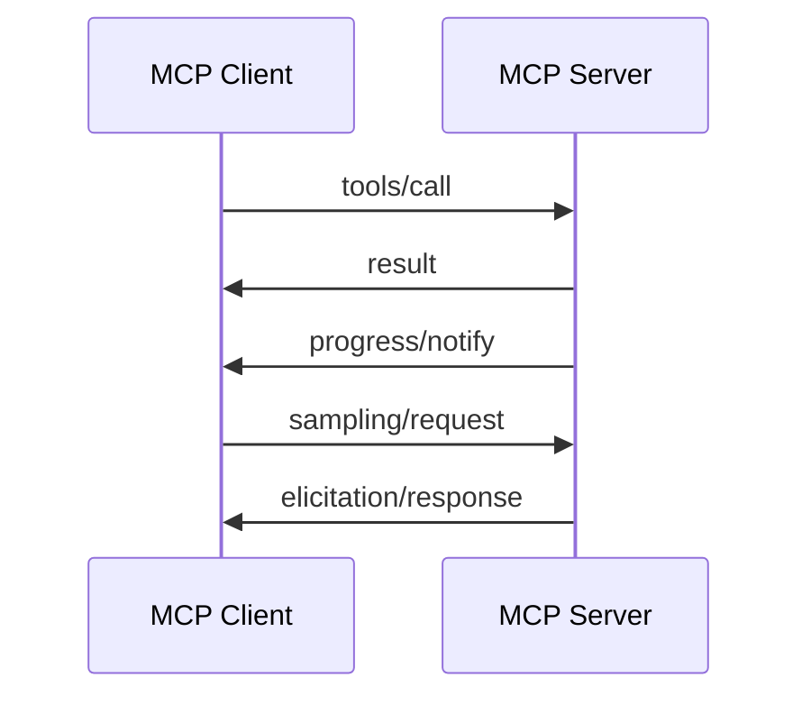

**Возможности**:
- Server-initiated messages как часть протокола
- Progress notifications в реальном времени  
- Elicitation (запрос дополнительных данных от пользователя)
- Standardized bidirectional communication
</div>

---

## Изменение роли оркестратора

### Классическая оркестрация: Centralized Control

<div style="font-size: 22px;">

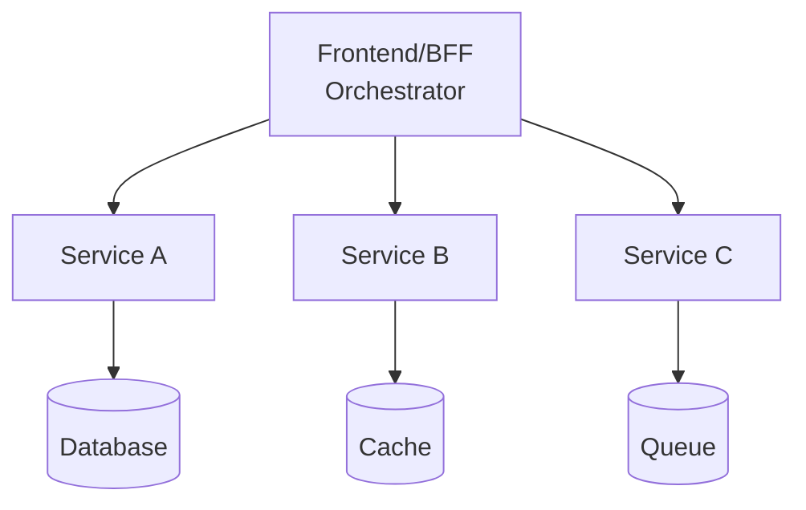

**Характеристики**:
- Явное программирование последовательности вызовов
- Централизованная логика принятия решений
- Предсказуемые пути исполнения
- Ошибки обрабатываются централизованно

### MCP оркестрация: Distributed Intelligence  

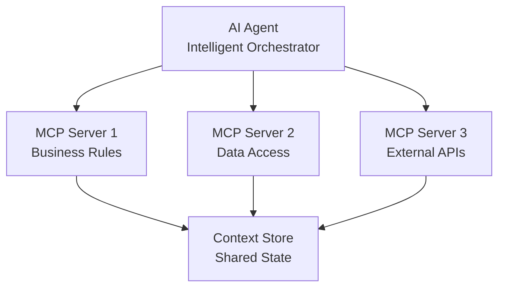

**Характеристики**:
- Динамическое планирование выполнения
- Распределенное принятие решений  
- Адаптивные пути исполнения
- Контекстно-зависимая обработка ошибок
</div>

---

## Распределение ответственности: новая парадигма

<div style="font-size: 25px;">

### Классическое распределение
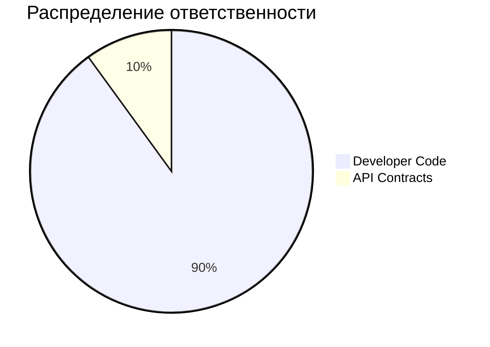

### MCP распределение  
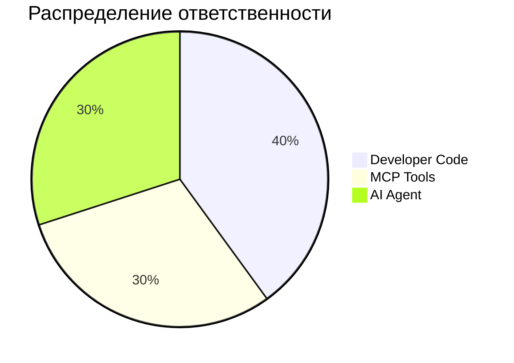

**Ключевые изменения в архитектурном мышлении**:
- От детального контроля к определению политик
- От статических контрактов к динамическим возможностям
- От централизованной логики к распределенному интеллекту
- От предсказуемости к адаптивности
</div>

---

## Классическая архитектура

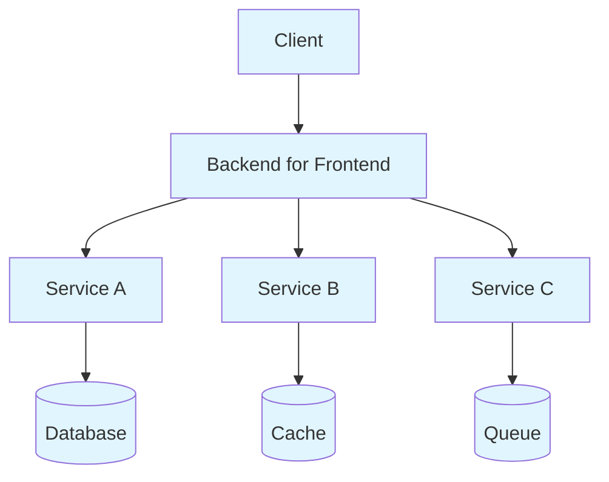

---

## MCP архитектура

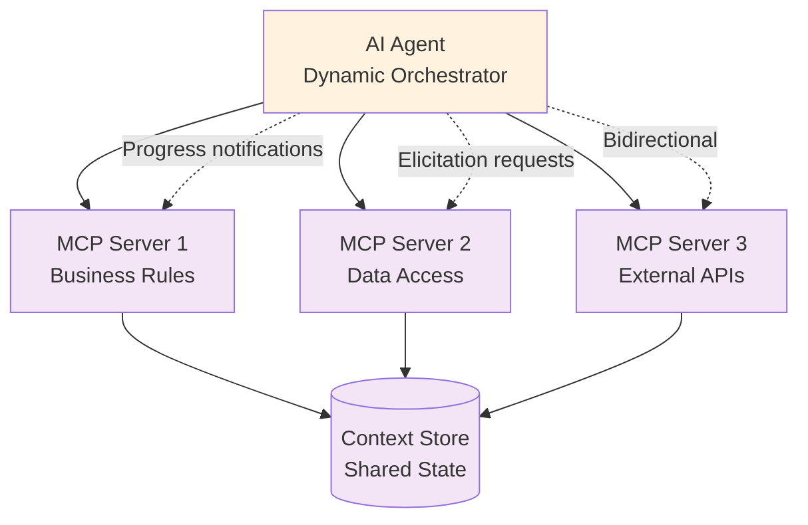

---

<!-- header: 8. Практическая реализация новой архитектуры -->

# 8. Практическая реализация новой архитектуры

---

## AI Gateway как центральный компонент
  - Отдельный слой для приёма MCP-трафика (пример — Azure API Management)
  - Лимиты, валидация аргументов, мониторинг и аудит
  - Контроль политик и защита от prompt injection

---

## Архитектурные паттерны:
  - MCP-сервер как фасад для микросервисов
  - Оборачивание нескольких REST-вызовов в один высокоуровневый инструмент
  - Проблемы транзакционности в новой архитектуре

---

## Наблюдаемость и надежность:
  - Tracing агентных вызовов
  - Fallback-стратегии при сбоях LLM
  - Timeout-ы и circuit breakers для агентов

---

## Пример архитектуры: корпоративная система с микросервисами

// TODO

---

<!-- header: 9. Вызовы и риски -->

# 9. Вызовы и риски

---

## Специфические угрозы AI-эпохи
  - Prompt injection атаки
  - "Фальшивые" инструменты-двойники
  - Утечки данных через объединение инструментов

---

## Изменения в модели безопасности
  - От доверия разработчику к контролю агента
  - Система разрешений на уровне инструментов
  - Моделирование поведения непредсказуемого клиента

---

## Стратегии защиты
  - Изоляция локальных vs удаленных MCP-серверов
  - Аудит и логирование агентной активности
  - Политики доступа и ограничения

---

<!-- header: 10. Практические bootstrap примеры -->

# 10. Практические bootstrap примеры

---

## Код на Go: MCP server

---

## Код на Python: MCP server
